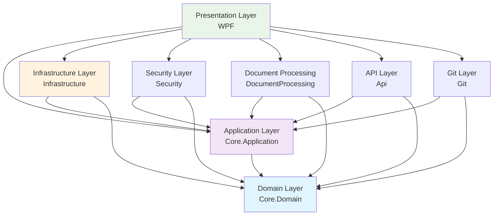

# Clean Architecture Overview - Anomali Threat Bulletin Import Tool

## Table of Contents
1. [Introduction](#introduction)
2. [Architecture Principles](#architecture-principles)
3. [Layer Responsibilities](#layer-responsibilities)
4. [Dependency Flow](#dependency-flow)
5. [Project Structure](#project-structure)
6. [Design Decisions](#design-decisions)
7. [Implementation Patterns](#implementation-patterns)
8. [Quality Assurance](#quality-assurance)

## Introduction

The Anomali Threat Bulletin Import Tool is built using Clean Architecture principles, ensuring a maintainable, testable, and scalable codebase. This document explains the architectural decisions, layer responsibilities, and implementation patterns used throughout the application.

### What is Clean Architecture?

Clean Architecture is a software design philosophy that separates the elements of a design into ring levels. The main rule of Clean Architecture is that source code dependencies can only point inwards. Nothing in an inner circle can know anything at all about something in an outer circle.

### Why Clean Architecture?

- **Independence**: Business logic is independent of frameworks, databases, and external agencies
- **Testability**: Business rules can be tested without the UI, database, web server, or any external element
- **UI Independence**: The UI can change easily without changing the rest of the system
- **Database Independence**: Business rules are not bound to any particular database
- **External Agency Independence**: Business rules don't know anything about the outside world

## Architecture Principles

### 1. Dependency Inversion Principle
- High-level modules should not depend on low-level modules
- Both should depend on abstractions
- Abstractions should not depend on details
- Details should depend on abstractions

### 2. Single Responsibility Principle
- Each class should have only one reason to change
- Each layer has a single, well-defined responsibility

### 3. Open/Closed Principle
- Software entities should be open for extension but closed for modification
- New functionality is added through new implementations, not by modifying existing code

### 4. Liskov Substitution Principle
- Objects of a superclass should be replaceable with objects of a subclass
- Interfaces and abstract classes define contracts that implementations must honor

### 5. Interface Segregation Principle
- Clients should not be forced to depend on interfaces they don't use
- Many specific interfaces are better than one general-purpose interface

## Layer Responsibilities

### 1. Domain Layer (Core.Domain)
**Location**: `src/AnomaliImportTool.Core.Domain/`

**Responsibilities**:
- Contains enterprise business rules and entities
- Defines domain models and business logic
- Implements value objects and domain primitives
- Defines domain events and exceptions
- Houses the shared kernel with common primitives

**Key Components**:
- **Entities**: `Document`, `ThreatBulletin`
- **Value Objects**: `FileMetadata`, `ApiResponse<T>`, etc.
- **Domain Primitives**: `EmailAddress`, `FilePath`, `ContentHash`, etc.
- **Domain Events**: `DocumentProcessedEvent`, `ThreatBulletinImportedEvent`, etc.
- **Enums**: `DocumentStatus`, `ThreatLevel`, `BulletinStatus`

**Rules**:
- ❌ No dependencies on other layers
- ❌ No infrastructure concerns (no I/O, databases, external services)
- ❌ No framework dependencies
- ✅ Pure business logic only
- ✅ Immutable value objects
- ✅ Rich domain models

```csharp
// Example: Domain Entity
public class ThreatBulletin : BaseEntity
{
    public string Title { get; private set; }
    public string Content { get; private set; }
    public ThreatLevel Level { get; private set; }
    public TlpDesignation TlpDesignation { get; private set; }
    
    // Business logic methods
    public void UpdateContent(string newContent)
    {
        Guard.Against.NullOrWhiteSpace(newContent, nameof(newContent));
        Content = newContent;
        AddDomainEvent(new ThreatBulletinUpdatedEvent(Id, newContent));
    }
}
```

### 2. Application Layer (Core.Application)
**Location**: `src/AnomaliImportTool.Core.Application/`

**Responsibilities**:
- Contains application business rules and use cases
- Defines interfaces for infrastructure concerns
- Implements application services and handlers
- Orchestrates domain objects to fulfill use cases
- Defines DTOs and application-specific models

**Key Components**:
- **Interfaces**: Repository and service contracts
- **Use Cases**: Command and query handlers
- **Application Services**: Orchestration logic
- **DTOs**: Data transfer objects
- **Dependency Injection**: Service registration

**Rules**:
- ✅ Can depend on Domain layer only
- ❌ No dependencies on infrastructure or presentation layers
- ✅ Defines abstractions for external concerns
- ✅ Contains use case implementations
- ✅ Orchestrates domain objects

```csharp
// Example: Application Service Interface
public interface IDocumentProcessingService
{
    Task<ProcessingResult> ProcessDocumentAsync(
        FilePath filePath, 
        CancellationToken cancellationToken = default);
}

// Example: Use Case Handler
public class ImportThreatBulletinHandler : IRequestHandler<ImportThreatBulletinCommand, ImportResult>
{
    private readonly IThreatBulletinRepository _repository;
    private readonly IAnomaliApiService _apiService;
    
    public async Task<ImportResult> Handle(
        ImportThreatBulletinCommand request, 
        CancellationToken cancellationToken)
    {
        // Orchestrate domain objects and infrastructure services
    }
}
```

### 3. Infrastructure Layer (Infrastructure)
**Location**: `src/AnomaliImportTool.Infrastructure/`

**Responsibilities**:
- Implements interfaces defined in the Application layer
- Contains database access, external API calls, file I/O
- Provides concrete implementations of repositories and services
- Handles cross-cutting concerns like logging and configuration

**Key Components**:
- **Repository Implementations**: Data access logic
- **External Service Clients**: API integrations
- **Cross-cutting Concerns**: Logging, caching, etc.
- **Configuration**: Settings and options

**Rules**:
- ✅ Can depend on Application and Domain layers
- ❌ Cannot depend on presentation layers
- ✅ Implements infrastructure interfaces
- ✅ Contains I/O operations
- ✅ Framework-specific code

### 4. Specialized Infrastructure Layers

#### Security Layer (Security)
**Location**: `src/AnomaliImportTool.Security/`

**Responsibilities**:
- Authentication and authorization
- Cryptographic operations
- Secure credential management
- Security-related services

#### Document Processing Layer (DocumentProcessing)
**Location**: `src/AnomaliImportTool.DocumentProcessing/`

**Responsibilities**:
- File parsing and processing
- Document format conversion
- Content extraction
- File validation

#### API Layer (Api)
**Location**: `src/AnomaliImportTool.Api/`

**Responsibilities**:
- Anomali ThreatStream API integration
- External API communication
- API response mapping
- Rate limiting and retry logic

#### Git Layer (Git)
**Location**: `src/AnomaliImportTool.Git/`

**Responsibilities**:
- Git repository operations
- Version control integration
- Commit and branch management
- Git workflow automation

### 5. Presentation Layer (WPF)
**Location**: `src/AnomaliImportTool.WPF/`

**Responsibilities**:
- User interface implementation
- User interaction handling
- View models and data binding
- UI-specific logic

**Rules**:
- ✅ Can depend on all other layers
- ✅ Contains UI-specific code
- ✅ Handles user interactions
- ❌ No business logic (delegates to Application layer)

## Dependency Flow



### Dependency Rules
1. **Domain Layer**: No dependencies (pure business logic)
2. **Application Layer**: Depends only on Domain
3. **Infrastructure Layers**: Depend on Application and Domain
4. **Presentation Layer**: Can depend on all layers

## Project Structure

```
AnomaliImportTool/
├── src/
│   ├── AnomaliImportTool.Core.Domain/           # Domain Layer
│   │   ├── Common/                              # Base classes
│   │   ├── Entities/                            # Domain entities
│   │   ├── Enums/                               # Domain enumerations
│   │   ├── SharedKernel/                        # Shared domain primitives
│   │   └── ValueObjects/                        # Value objects
│   │
│   ├── AnomaliImportTool.Core.Application/      # Application Layer
│   │   ├── DependencyInjection/                 # Service registration
│   │   ├── Interfaces/                          # Abstractions
│   │   │   ├── Infrastructure/                  # Infrastructure interfaces
│   │   │   ├── Repositories/                    # Repository interfaces
│   │   │   └── Services/                        # Service interfaces
│   │
│   ├── AnomaliImportTool.Infrastructure/        # Base Infrastructure
│   ├── AnomaliImportTool.Security/              # Security Services
│   ├── AnomaliImportTool.DocumentProcessing/    # Document Processing
│   ├── AnomaliImportTool.Api/                   # External API Integration
│   ├── AnomaliImportTool.Git/                   # Git Operations
│   └── AnomaliImportTool.WPF/                   # Presentation Layer
│
├── tests/                                       # Test Projects
│   ├── AnomaliImportTool.Tests.Unit/
│   ├── AnomaliImportTool.Tests.Integration/
│   ├── AnomaliImportTool.Tests.Architecture/    # Architecture Fitness Tests
│   ├── AnomaliImportTool.Tests.Performance/
│   ├── AnomaliImportTool.Tests.Security/
│   └── AnomaliImportTool.Tests.EndToEnd/
│
└── docs/                                        # Documentation
    └── architecture/                            # Architecture Documentation
```

## Design Decisions

### 1. Modular Monolith Architecture
**Decision**: Use a modular monolith instead of microservices
**Rationale**: 
- Simpler deployment and debugging
- Easier transaction management
- Lower operational complexity
- Can evolve to microservices if needed

### 2. Specialized Infrastructure Assemblies
**Decision**: Separate infrastructure concerns into dedicated assemblies
**Rationale**:
- Better separation of concerns
- Easier to test individual components
- Improved maintainability
- Clear boundaries between different infrastructure concerns

### 3. Rich Domain Model
**Decision**: Implement a rich domain model with business logic in entities
**Rationale**:
- Encapsulates business rules where they belong
- Reduces anemic domain model anti-pattern
- Improves maintainability and testability
- Better expresses domain concepts

### 4. Value Objects and Domain Primitives
**Decision**: Extensive use of value objects and domain primitives
**Rationale**:
- Type safety and validation
- Immutability guarantees
- Self-documenting code
- Prevents primitive obsession

### 5. Assembly Scanning for Dependency Injection
**Decision**: Automatic service registration using assembly scanning
**Rationale**:
- Reduces boilerplate code
- Convention over configuration
- Easier to maintain
- Consistent registration patterns

### 6. Architecture Fitness Functions
**Decision**: Implement automated architecture validation
**Rationale**:
- Prevents architecture drift
- Continuous validation of design decisions
- Early detection of violations
- Living documentation of constraints

## Implementation Patterns

### 1. Repository Pattern
```csharp
// Interface in Application Layer
public interface IThreatBulletinRepository
{
    Task<ThreatBulletin?> GetByIdAsync(Guid id, CancellationToken cancellationToken = default);
    Task<IEnumerable<ThreatBulletin>> GetAllAsync(CancellationToken cancellationToken = default);
    Task AddAsync(ThreatBulletin bulletin, CancellationToken cancellationToken = default);
    Task UpdateAsync(ThreatBulletin bulletin, CancellationToken cancellationToken = default);
    Task DeleteAsync(Guid id, CancellationToken cancellationToken = default);
}

// Implementation in Infrastructure Layer
[ServiceRegistration(typeof(IThreatBulletinRepository), ServiceLifetime.Scoped)]
public class ThreatBulletinRepository : IThreatBulletinRepository
{
    // Implementation details
}
```

### 2. Domain Events Pattern
```csharp
// Domain Event
public class ThreatBulletinImportedEvent : BaseDomainEvent
{
    public Guid BulletinId { get; }
    public string Source { get; }
    
    public ThreatBulletinImportedEvent(Guid bulletinId, string source)
    {
        BulletinId = bulletinId;
        Source = source;
    }
}

// Event Handler in Application Layer
public class ThreatBulletinImportedEventHandler : INotificationHandler<ThreatBulletinImportedEvent>
{
    public async Task Handle(ThreatBulletinImportedEvent notification, CancellationToken cancellationToken)
    {
        // Handle the event
    }
}
```

### 3. Value Objects Pattern
```csharp
public readonly record struct EmailAddress
{
    private readonly string _value;
    
    public EmailAddress(string value)
    {
        Guard.Against.NullOrWhiteSpace(value, nameof(value));
        Guard.Against.InvalidEmail(value, nameof(value));
        _value = value;
    }
    
    public static implicit operator string(EmailAddress email) => email._value;
    public static explicit operator EmailAddress(string value) => new(value);
    
    public override string ToString() => _value;
}
```

### 4. Service Registration Pattern
```csharp
[ServiceRegistration(typeof(IDocumentProcessingService), ServiceLifetime.Scoped)]
public class DocumentProcessingService : IDocumentProcessingService
{
    private readonly ILogger<DocumentProcessingService> _logger;
    private readonly IDocumentRepository _repository;
    
    public DocumentProcessingService(
        ILogger<DocumentProcessingService> logger,
        IDocumentRepository repository)
    {
        _logger = logger;
        _repository = repository;
    }
    
    public async Task<ProcessingResult> ProcessDocumentAsync(
        FilePath filePath, 
        CancellationToken cancellationToken = default)
    {
        // Implementation
    }
}
```

## Quality Assurance

### 1. Architecture Fitness Functions
- **45 automated tests** validate architectural constraints
- **Continuous monitoring** of dependency rules
- **89% current compliance** with target of 100%
- **CI/CD integration** for ongoing validation

### 2. Testing Strategy
- **Unit Tests**: Test individual components in isolation
- **Integration Tests**: Test component interactions
- **Architecture Tests**: Validate structural constraints
- **Performance Tests**: Ensure performance requirements
- **Security Tests**: Validate security implementations
- **End-to-End Tests**: Test complete user scenarios

### 3. Code Quality Measures
- **Type Safety**: Strong typing throughout
- **Immutability**: Value objects and domain primitives
- **Validation**: Guard clauses and input validation
- **Error Handling**: Comprehensive exception handling
- **Logging**: Structured logging throughout

### 4. Documentation Standards
- **Architecture Documentation**: This document and related docs
- **API Documentation**: XML documentation comments
- **Code Comments**: Inline documentation for complex logic
- **README Files**: Project-specific documentation

## Benefits of This Architecture

### 1. Maintainability
- Clear separation of concerns
- Easy to understand and modify
- Minimal coupling between layers
- Consistent patterns throughout

### 2. Testability
- Easy to unit test business logic
- Mockable dependencies
- Isolated components
- Fast test execution

### 3. Flexibility
- Easy to swap implementations
- Framework independence
- Database independence
- UI independence

### 4. Scalability
- Modular design allows selective scaling
- Clear boundaries for optimization
- Easy to identify bottlenecks
- Supports future architectural evolution

### 5. Team Productivity
- Clear boundaries and responsibilities
- Consistent patterns reduce learning curve
- Parallel development capabilities
- Reduced merge conflicts

## Conclusion

The Clean Architecture implementation in the Anomali Threat Bulletin Import Tool provides a solid foundation for building maintainable, testable, and scalable software. By following the principles outlined in this document, the development team can ensure that the application remains flexible and adaptable to changing requirements while maintaining high code quality and architectural integrity.

The combination of clear layer responsibilities, dependency inversion, and automated architecture validation creates a robust development environment that supports long-term success and maintainability. 